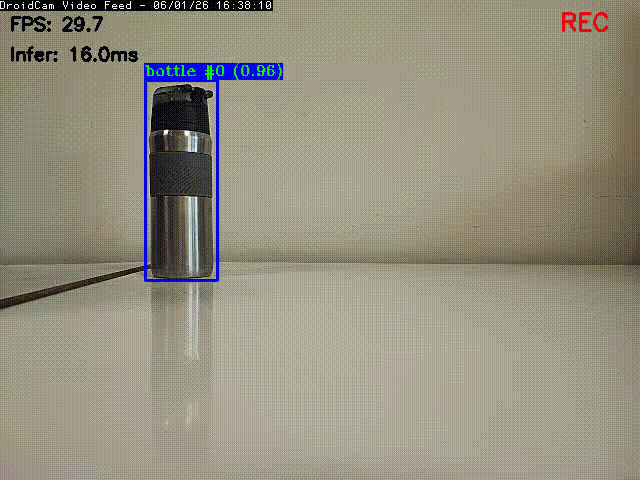
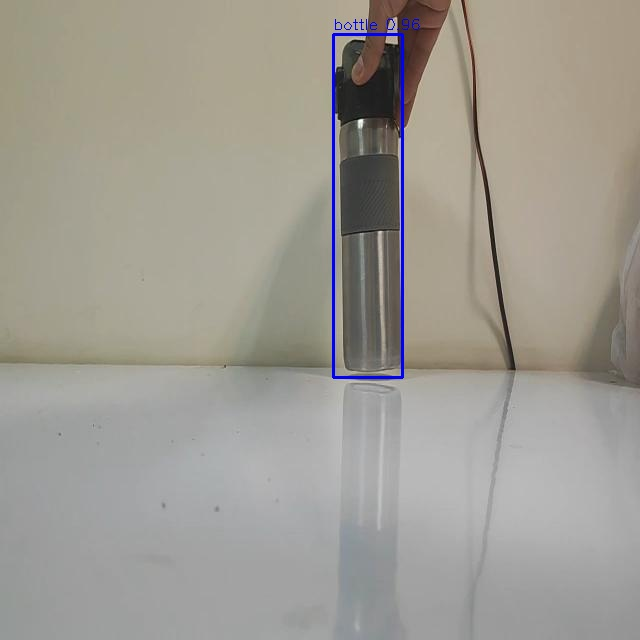
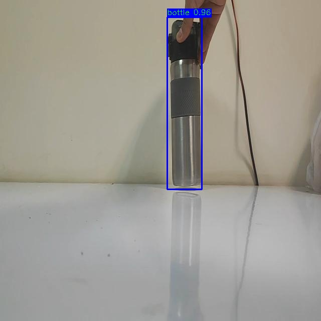
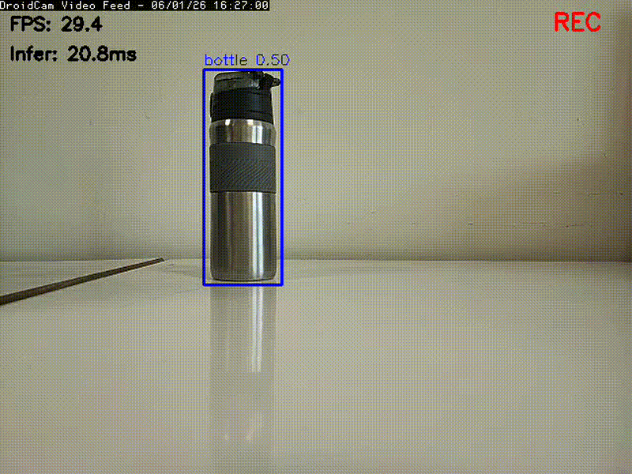
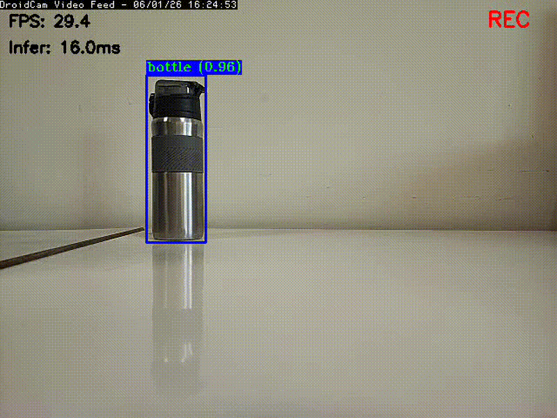
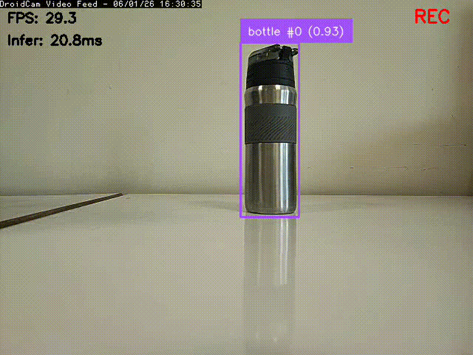

# ⚡ High-Performance YOLO26 Pipeline for Hailo-8L (Raspberry Pi 5)

[](https://opensource.org/licenses/MIT)
[](#)
[](#)

<p align="center">
  
  <br>
  <em>Real-time YOLO26 + BoTSORT tracking running natively in C++ on the Raspberry Pi 5 & Hailo-8L.</em>
</p>

Welcome to the ultimate end-to-end repository for training, compiling, and deploying **YOLO26 Nano** models on the **Raspberry Pi 5** using the **Hailo-8L AI Accelerator**. 

This project bridges the gap between high-level deep learning and bare-metal edge deployment. It provides a complete pipeline from a custom PyTorch dataset all the way to real-time, multi-object tracking in highly optimized C++.

---

## 🧠 System Architecture & Deep Dive

Deploying modern neural networks on edge AI accelerators requires a multi-stage pipeline. This repository is architected to handle each phase in isolated, optimized environments.

### 1. The NMS-Free Dual-Head Concept
Traditional YOLO architectures rely heavily on Non-Maximum Suppression (NMS) to filter out overlapping bounding boxes. NMS is computationally expensive and difficult to run on NPUs. 
**YOLO26** utilizes an "NMS-free" dual-head design. The Hailo-8L hardware handles the heavy feature extraction (the backbone), while the Raspberry Pi CPU executes a highly vectorized, NMS-free mathematical decoding step (the post-processing head). This repository dynamically supports any number of custom classes across both Python and C++ for this dual-head architecture.

### 2. The Compilation Gap (Why Docker?)
The Hailo Dataflow Compiler (DFC)—the software that translates `.onnx` models into Hailo's native `.hef` format—requires a strict x86_64 Ubuntu environment and massive CPU RAM to explore memory partitions. It **cannot** run on the ARM-based Raspberry Pi. Therefore, we isolate this step using a Docker container, allowing you to compile your edge model safely on any desktop PC before transferring it to the Pi.

### 3. Advanced Object Tracking (BoTSORT)
Raw AI detections jitter. To create a production-ready system, we integrate the **BoTSORT** tracking algorithm. This repository introduces custom engineering to stabilize tracking on edge devices:
* **Padding Inflation:** Temporarily expanding bounding boxes prior to tracker ingestion to maximize IoU (Intersection over Union) overlap and prevent identity loss during fast motion.
* **EMA Smoothing:** Applying an Exponential Moving Average to the output coordinates to eliminate visual vibration on the final video feed.

---

## 🗺️ Repository Navigation

Because this is a full-stack pipeline, the repository is split into dedicated modules. **Please refer to the specific `README.md` in each directory for detailed, step-by-step instructions.**

Directory | Purpose | Documentation Link |
| :--- | :--- | :--- |
| **`training/`** | Google Colab / Jupyter notebooks for training the YOLO26 model on custom datasets (e.g., Bottle detection) and exporting it to ONNX. | [📖 Read Training Guide](training/README.md) |
| **`export/`** | A Dockerized x86_64 environment containing the Hailo compiler. Automates INT8 calibration and compiles `.onnx` to `.hef`. | [📖 Read Export Guide](export/README.md) |
| **`python/`** | Python implementations of the inference and tracking pipelines, ideal for rapid prototyping and testing. | [📖 Read Python Guide](python/README.md) |
| **`cpp/`** | The maximum-performance runtime environment. Contains `detect_video.cpp` and `track_video.cpp` for bare-metal execution. | [📖 Read C++ Guide](cpp/README.md) |
| **`docs/`** | Hardware setup guides, specifically bypassing Wi-Fi latency by using an Android smartphone as a wired USB camera. | [📖 Read USB Camera Guide](docs/android_usb_camera.md) |

---

## 🚀 Quick Start Guide

If you want to skip training and compilation and immediately test the provided pre-compiled weights on your Raspberry Pi 5, follow these steps:

### 1. Install System Dependencies
Ensure your Raspberry Pi 5 is running a 64-bit OS with the Hailo-8L drivers installed.
```bash
# Install Python dependencies for the Root Python scripts
pip install -r requirements.txt

# Install OpenCV and CMake for the C++ pipeline
sudo apt update
sudo apt install libopencv-dev cmake build-essential
```

### 2. Install the Tracker Dependency
Both the Python and C++ tracking scripts rely on an external BoTSORT tracking library.

* Clone and install the system-level library from: [MatinRafiei/roboflow-trackers-cpp](https://github.com/MatinRafiei/roboflow-trackers-cpp)

### 3. Run Inference (Python Prototype)
Test the pipeline immediately using Python:

```bash
python track_video.py \
    --camera-id 0 \
    --hef training/model/bottle.hef \
    --labels bottle \
    --debug
```
### 4. Run Inference (C++ Production)
For maximum FPS and lowest thermal load, build and run the C++ pipeline:

```bash
cd cpp
mkdir build && cd build
cmake ..
make -j4

./track_video \
    --camera-id 0 \
    --hef ../../training/model/bottle.hef \
    --labels bottle
```

## 📊 Performance Comparison: Python vs C++

While the Python wrapper is excellent for prototyping, our C++ pipeline extracts the maximum possible frame rate from the Raspberry Pi 5.

| Pipeline | Python (Wrapper) | C++ (Bare Metal) |
| :--- | :--- | :--- |
| **Static Image** |  |  |
| **Live Detection** |  |  |
| **Live Tracking** |  |  |

### ⏱️ Performance Insights & Hardware Bottlenecks
The physical USB camera used in the demonstrations above is hardware-limited to **30 FPS**, which creates an artificial bottleneck for the pipeline. 

Looking strictly at the Hailo-8L calculation speeds:
* **Python Pipeline:** Achieves ~20ms inference times, theoretically supporting up to **50 FPS**.
* **C++ Pipeline:** Achieves an incredibly fast ~15-16ms inference time, pushing the theoretical limit to **62-67 FPS**.

The performance of the Hailo chip is remarkably well-optimized, especially within the bare-metal C++ environment. By upgrading to a high-framerate camera sensor (e.g., 60fps+), users can fully unlock and utilize the maximum computing power of the Hailo-8L accelerator.


## 🤝 Acknowledgements & Attributions

* **YOLO26 & Hailo Architecture:** The base Python and C++ tensor parsing logic (`common.py`, `postprocess.hpp`) was adapted from the excellent foundation provided by [DanielDubinsky/yolo26_hailo](https://github.com/DanielDubinsky/yolo26_hailo). It has been extensively modified in this repository to support dynamic class configurations, robust CLI parsing, and real-time tracking integration.
* **Tracking Algorithms:** Multi-object tracking is powered by BoTSORT, interfaced via [Roboflow Supervision](https://github.com/roboflow/supervision) (Python) and custom ports (C++).
* **Hardware:** Developed specifically for the Raspberry Pi 5 and the Hailo AI ecosystem.

## 📄 License
This project is licensed under the [MIT License](LICENSE) - see the LICENSE file for details. *(Note: The underlying Ultralytics YOLO architecture used for training is subject to the AGPL-3.0 license).*

